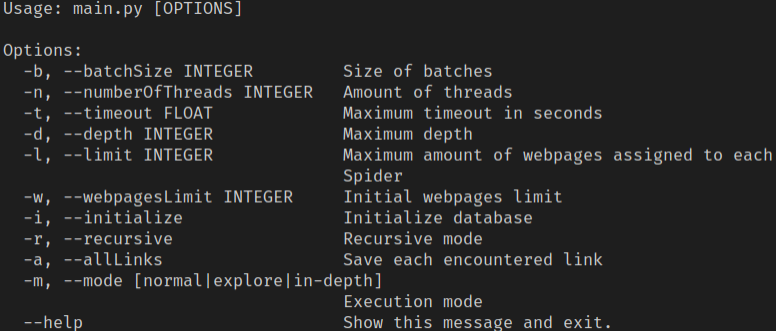
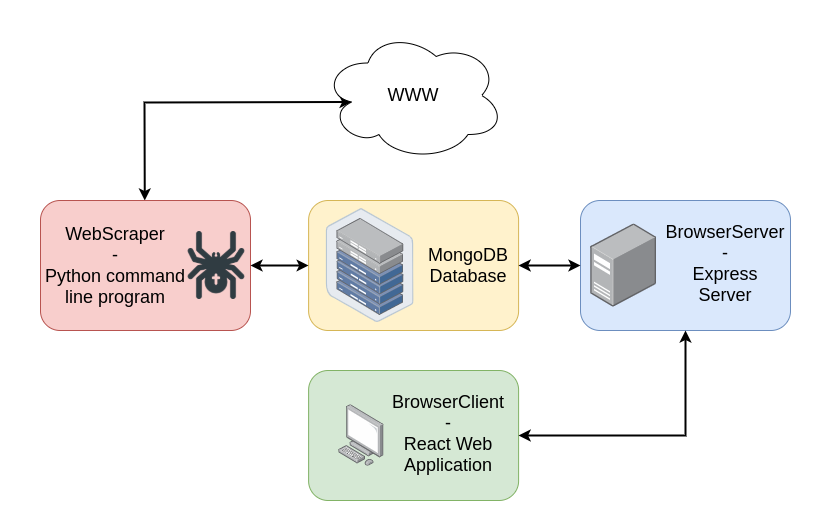

# WebScraper

Python command line program for retrieving and storing webpages information on a _MongoDB_ database. It was developed as a part of the final project of Data Acquisition and Integration subject.

## Usage

To be able to use the program it is necessary to install the dependencies first:

```bash
$ conda create --name environment_name --file spec-file.txt
```

Once the dependencies have been installed it is possible to start the program:

```bash
$ python3 src/main.py --help
```

<div style="text-align:center;"></div>

### Options

- **-b, --batchSize**: Size of spiders batches. Establish the frequency of database save operations. When a batch is completed, the spider performs a save operation in the database with the obtained results.
- **-n, --numberOfThreads**: Amount of execution threads
- **-t, --timeout**: HTTP GET petitions timeout in seconds.
- **-d, --depth**: Maximum amount of recursivity levels when exploring webpages links.
- **-l, --limit**: Maximum amount of webpages assigned to each spider.
- **-i, --initialize**: Tells whether to initialize the database or not.
- **-r, --recursive**: Recursive mode. When a spider retrieves a webpage, extracts it's links and the recursive flag is set to true, the same spider will visit those links whenever possible (only if the limit had not be reached)
- **-a, --allLinks**: Tells whether to store all possible links or not. By default, spider will only store "internal links"
- **-m, --mode**: Specifies the execution mode, execution modes are presets of options:
  - _explore_: The spider will visit only new domains, saving all links and without recursivity.
  - _in-depth_: The spider will visit only links of known domains recusively.

## About the project

<div style="text-align:center;"></div>

With [BrowserClient](https://github.com/DauteRR/BrowserClient), users are able to search information about registered webpages. The petitions made by [BrowserClient](https://github.com/DauteRR/BrowserClient) are resolved by [BrowserServer](https://github.com/DauteRR/BrowserServer). Webpages information is stored in a _MongoDB_ database using [WebScraper](https://github.com/DauteRR/WebScraper). The database has 3 collections:

- **visited**: Stores information about visited webpages
  - _title_: Webpage title
  - _meta_: Information extracted from webpages meta tags
    - _keywords_
    - _description_
    - _author_
    - _lang_
    - _locality_
    - _organization_
  - _content_: Filtered webpage content
  - _headers_: Webpage headers
  - _lastVisited_: Timestamp
  - _url_: Webpage url
  - _baseDomain_: Flag indicating if the url corresponds to a base domain
- **notVisited**: Stores information about the webpages to be visited
  - _url_: Webpage url
  - _depth_: Recursivity depth, obtained during the document registry process
  - _baseDomain_: Flag indicating if the url corresponds to a base domain
- **error**: Stores information about webpages that were not stored due to an error
  - _lastVisited_: Timestamp
  - _url_: Webpage url
  - _baseDomain_: Flag indicating if the url corresponds to a base domain
  - _errorType_: Error type
  - _message_: Error message

### Setup

To initialize the database it is necessary to execute [WebScraper](https://github.com/DauteRR/WebScraper) specifying -i or --initialize option:

```bash
$ python3 src/main.py --initialize
```

Once the database is initialized, it is possible to start using [WebScraper](https://github.com/DauteRR/WebScraper) for retrieve webpages information. For more details, see README.md file in [WebScraper](https://github.com/DauteRR/WebScraper) repository.

After obtaining and storing information, it's time to start [BrowserServer](https://github.com/DauteRR/BrowserServer). For more information, visit [BrowserServer](https://github.com/DauteRR/BrowserServer) repository and check README.md file.

In order to perform searches it is necessary to start [BrowserClient](https://github.com/DauteRR/BrowserClient) web application as showed below.
